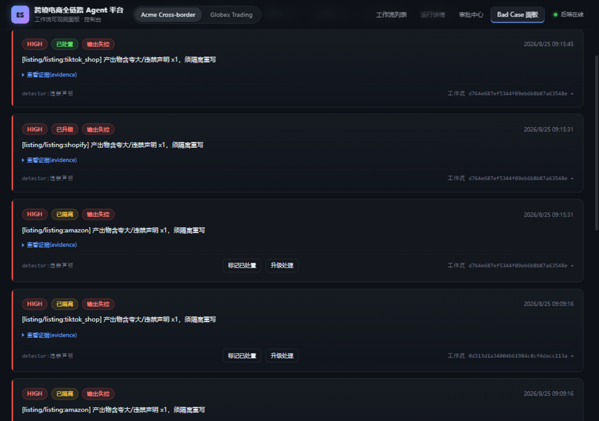
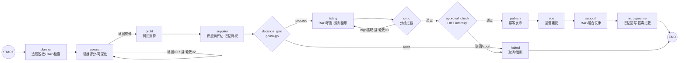
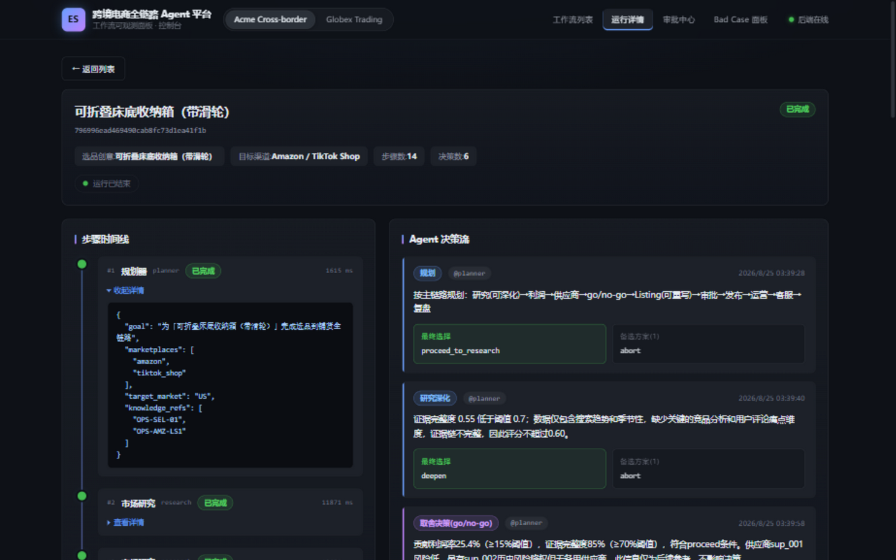
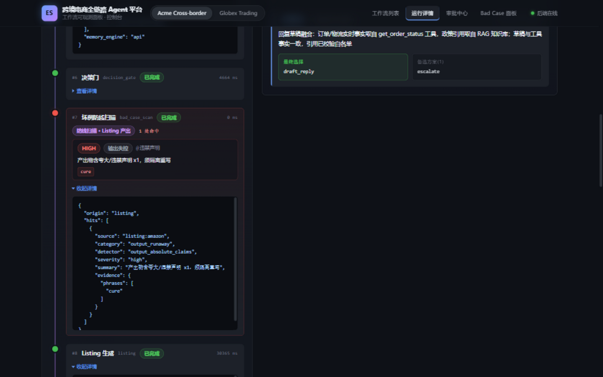
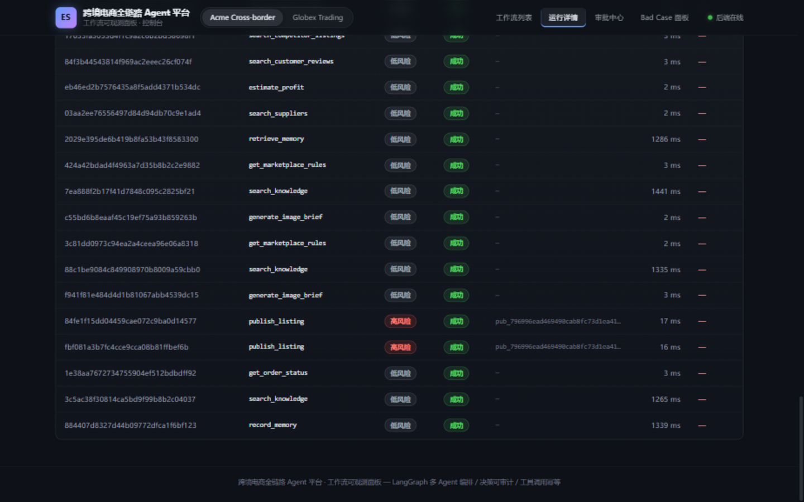

# Cross Eshop Agent —— 跨境电商全链路 Agent 平台

[](https://github.com/dengzhuofu/cross-eshop-agent/actions/workflows/ci.yml)

面向中小跨境卖家的多租户 Agent 运营平台：选品研究 → 利润测算 → 供应商评估 → go/no-go 决策闸门 → 多平台 Listing 生成（生成-评审-重写闭环）→ 人工审批 → 模拟发布 → 运营监控 → 客服售后 → 复盘回流。

> 当前进度：**M8 已完成，v1.4 全里程碑收官**。M0 行走骨架 → M1 工具治理层 → M2 LLM 接入（SiliconFlow/DeepSeek-V3.2）→ M3 三角真身（profit/supplier 数据工具化、critic LLM 审查、image brief 工具化）→ M4 长期记忆双线（供应商风险检索降权 / 复盘经验回写，租户隔离）+ 上下文压缩接缝 + token 硬熔断 → M5 真实人工审批（LangGraph interrupt/resume + SqliteSaver 检查点 + 审批中心前端）→ M6 客服 RAG（五类知识集合 + search_knowledge/get_order_status 治理工具 + 融合铁律：草稿时效与工具冲突即弃稿回退）→ M7 BadCase 红队（detector 注册表 + planner 输入脱敏 / Listing 扫描 / 记忆回写拦截三道防线 + 3 条红队 seed 的 eval CI 门禁）→ M8 打磨（主链路自用 RAG：planner/listing 主动检索 ops_playbook 运营知识库 + Demo 兜底缓存 ResultCache + docker-compose 一键起 + Bad Case 前端面板 + 一键 reset & replay）。核心设计：**LLM 只提议，代码做硬保证**——评分封顶、平台规则整形、绝对化措辞生成端改写（CLAIM_HEDGE_MAP）、critic 分级拦截（high 阻塞重写 / medium 仅记录）、决策 rubric 优先级、RAG 与工具冲突以工具为准，全由确定性代码兜底；无 key 自动降级 stub/hash 引擎，测试 CI 零出网。

## 快速开始

```bash
cd backend

# 1) 环境
py -3 -m venv .venv                       # Windows；Linux/macOS 用 python3 -m venv .venv
source .venv/Scripts/activate             # Windows Git Bash；cmd 用 .venv\Scripts\activate.bat
pip install -e ".[dev]"

# 2) 真实 PostgreSQL（无需 Docker：用本机 PG 二进制初始化专属实例，端口 15433）
bash scripts/dev_postgres.sh              # 输出 DATABASE_URL
cp .env.example .env                      # 把上面输出的 DATABASE_URL 填进去

# 3) （可选）接入真实 LLM：在 .env 填入 SILICONFLOW_API_KEY
#    不填则所有节点走确定性 stub，功能链路完全一致（测试/CI 默认 stub，零网络依赖）

# 4) 种子数据 + 启动 API
python scripts/seed_mock_data.py          # 两个演示租户：t_demo_acme / t_demo_globex
python -m uvicorn app.api.main:app --port 8000
```

创建并观察一条完整工作流：

```bash
curl -X POST http://127.0.0.1:8000/api/v1/workflows \
  -H "Content-Type: application/json" -H "X-Tenant-Id: t_demo_acme" \
  -d '{"product_idea":"可折叠床底收纳箱","marketplaces":["amazon","tiktok_shop"]}'

# 稍候两秒后：
curl -H "X-Tenant-Id: t_demo_acme" http://127.0.0.1:8000/api/v1/workflows/<id>
curl -H "X-Tenant-Id: t_demo_acme" http://127.0.0.1:8000/api/v1/workflows/<id>/trace
```

`trace` 里能看到：planner 规划 → 研究证据不足 **自主触发第二轮深化** → 利润/供应商 → **go/no-go = proceed** → Listing 首轮含违规声明被 Critic 打回 → **带约束重写后通过** → dev 自动放行 → 发布（幂等键）→ 运营建议（高风险标记）→ 客服草稿 → 复盘（记忆回写接缝）。

LangGraph Studio 本地调试图定义（与 FastAPI 共用同一份 `graph` 导出）：

```bash
python -m langgraph dev   # 需要 langgraph-cli[inmem]
```

重置演示数据：`python scripts/reset_demo.py`

一键重置并重放完整链路（迁移→种子→发起新工作流→等到终态）：

```bash
bash scripts/reset_and_replay.sh            # 可选参数：自定义选题文案
```

### Docker Compose 一键起全栈（无需本机 PG/Node）

```bash
docker compose up --build                   # 访问 http://localhost:8088
```

默认无 LLM key（全链路确定性 stub，功能一致零出网）。要用真实 LLM 产出做离线演示：先在有 key 的环境跑 `python scripts/warm_demo_cache.py` 预热 Demo 兜底缓存（`ResultCache` 接口的精确 hash 实现，v1.4 §1.2 接缝；Phase 2 同接口换 embedding 相似度），再把缓存文件与 `DEMO_CACHE_MODE=read` 交给无 key 环境重放。

## 前端可观测面板

```bash
cd frontend
npm install
npm run dev        # http://localhost:5173（vite 代理 /api → 127.0.0.1:8000）
```

功能：租户切换（数据隔离直观可见）· 工作流列表与创建表单（含「发布前需人工审批」勾选）· 运行详情页（步骤时间线 / Agent 决策卡片流 / 工具调用审计表 / 防线扫描警示块）· 审批中心（HITL 挂起队列 + 角标 + Listing 快照预览 + 通过/驳回与附言审计）· Bad Case 面板（八类筛选 + 隔离记录 + 证据展开 + 回溯工作流现场），非终态自动 1.5s 轮询。深色仪表盘风格，零组件库。



## 架构速览

### 图拓扑（与 `agent.py` 定义一一对应）



三个循环都带硬上限护栏（研究深化 ≤2、Critic 重写 ≤3，PRD §14.3）；`approval_check` 是 LangGraph `interrupt()` 断点，人工审批后 `Command(resume)` 续跑。

### 目录结构

```
backend/src/app/
├── graphs/product_launch/     # LangGraph 应用部分（官方形制）
│   ├── agent.py               #   构建并导出 graph 变量 ← langgraph.json 指向这里
│   ├── state.py               #   图状态 + scratchpad reducer
│   ├── nodes.py               #   十三个执行器节点（research/profit/supplier/gate/listing/critic 已真实化，其余 stub）
│   └── edges.py               #   纯路由 + 循环硬上限
├── api/                       # FastAPI 壳层（workflows CRUD + trace + 租户注入）
├── adapters/                  # MarketplaceAdapter 协议：同接口不同平台规则（amazon/shopify/tiktok mock）
├── tools/                     # typed tools：注册中心 + ToolExecutor 唯一调用通道
│   ├── registry.py            #   ToolDefinition（schema/风险/幂等/审批/超时）
│   ├── executor.py            #   校验→跨租户检测→审批门→幂等回放→超时→审计（handler 异常统一包装）
│   └── catalog/               #   13 个治理工具：marketplace/research/profit/supplier/media/memory/knowledge/order
├── llm/                       # SiliconFlow 客户端（重试/usage/JSON 提取/门控）+ embeddings（bge-m3 1024 维，无 key 降级确定性 hash）
├── persistence/               # SQLAlchemy 模型与仓储 —— workflow 状态唯一真源
│   └── migrations/            # alembic（0001 业务表 + 0002 memories + 0003 knowledge_base + 0004 bad_cases）
├── guardrails/badcases.py     # detector 注册表（独立实现/注册，纯确定性正则零 LLM）+ scrub_untrusted 与 detector 共享同一组正则
├── evals/redteam.py           # 红队 seed 定义与执行（注入 A / 违禁声明 B / 记忆投毒 F），backend/evals/run_evals.py 为 standalone CI 门禁
├── cache/result_cache.py      # ResultCache 接缝（v1.4 §1.2）：MVP 精确 hash 文件实现服务 Demo 兜底，Phase 2 同接口换语义相似度
├── observability/recorder.py  # RunRecorder：节点→WorkflowStep/AgentDecision 的唯一写入口
├── multitenancy/              # TenantContext 注入（铁律：tenant_id 永远系统注入）
├── domain/                    # 业务枚举（状态机/风险等级/决策类型/BadCase 八类）
└── config.py                  # pydantic-settings，.env 唯一配置真源
```

四条结构性规则（详见 docs/v1.4 修订案 §2.3）：

1. **三分规则**：`domain/`=内部对象、`schemas/`=wire DTO、工具 IO schema 独立。
2. **双真源规则**：workflow 状态唯一真源是 repositories（PostgreSQL）；LangGraph checkpoint 只做断点恢复。
3. **不引入 BaseStore**：长期记忆走自建 pgvector 表（M4）。
4. **单一定义两种运行时**：图只在 `agent.py` 定义一次，`langgraph dev` 与 FastAPI 共用。

## 测试

```bash
pytest -q        # 单测（路由护栏上限）+ 集成（全链路对库跑通、跨租户 IDOR 阻断）
ruff check src tests scripts evals
python evals/run_evals.py   # 红队回归门禁：3 条 seed 全过才放行（exit 非 0 即防线被击穿）
```

测试使用临时 SQLite 保持封闭；运行时默认连接真实 PostgreSQL（`.env` 的 `DATABASE_URL`）。

## 里程碑路线图

| 里程碑 | 内容 | 状态 |
| --- | --- | --- |
| M0 | walking skeleton：十三步 stub 链路 + 状态机持久化 + 决策时间线 + 租户隔离 + 循环护栏 | ✅ |
| M1 | 工具治理层：MarketplaceAdapter 协议 + 三平台差异化规则 + ToolExecutor（schema 校验/跨租户引用检测/审批门/幂等回放/审计）+ ToolCall 审计表 + alembic 迁移 | ✅ |
| M2 | 三角真身(上)：SiliconFlow 接入 + research 证据评分/深化回路 + go/no-go LLM 决策 + Listing 三平台 LLM 文案（critic 约束回注重写）| ✅ |
| M3 | 三角真身(下)：profit/supplier 走治理工具（佣金率取自 adapter）+ critic LLM 审查（high 阻塞/medium 记录的分级拦截）+ generate_image_brief 工具化 + ToolHandlerError 包装 | ✅ |
| M4 | 长期记忆双线：retrieve/record_memory 治理工具（bge-m3 嵌入，无 key 降级 hash；租户隔离）+ supplier 风险记忆检索降权 / 复盘经验回写 + 绝对化措辞生成端改写（收敛硬保证）+ 上下文压缩接缝 + token 硬熔断 | ✅ |
| M5 | 真实人工审批：LangGraph `interrupt()`/`Command(resume)` + AsyncSqliteSaver 检查点（`.localdata/checkpoints.db`，仅作恢复非真源）+ 审批快照落库（`pending_approval`）+ `GET /approvals` / `POST /workflows/{id}/approval` + 前端审批中心（角标/快照卡/通过驳回/附言入审计）+ 按工作流 auto_approve 覆盖 | ✅ |
| M6 | 客服 RAG：`knowledge_base` 表（迁移 0003，五类知识 policy/platform_rule/product_info/faq/script，租户隔离）+ `search_knowledge` / `get_order_status` 治理工具（工具数 11→13）+ node_support 融合铁律（订单事实走工具、政策引用走 RAG、草稿时效与工具 ETA 冲突即整稿弃用回退模板）+ 退款工单强制升级 + seed 脚本 22 条知识（bge-m3） | ✅ |
| M7 | Bad Case 红队：detector 注册表（input_injection / output_absolute_claims / memory_poisoning，纯确定性正则零 LLM，新类别=新注册不动主干）+ 三道防线接线（planner 输入脱敏 scrub_untrusted → Listing 全文扫描 → 复盘记忆回写拦截）+ `bad_cases` 表（迁移 0004）+ `GET /api/v1/badcases` + JSONL 导出脚本 + 3 条红队 seed 门禁（pytest 参数化 + standalone `run_evals.py` 双形态；红队曾真实击穿注入漏洞并推动脱敏防线落地） | ✅ |
| M8 | 打磨收官：主链路自用 RAG（知识库新增 ops_playbook 运营打法类共 27 条；planner 检索选品方法论、listing 按平台检索 Listing 守则注入生成参考并留痕 knowledge_refs）+ Demo 兜底缓存（`ResultCache` 接口 + 精确 hash 实现 + `warm_demo_cache.py` 预热/离线重放）+ docker-compose 一键起全栈 + 前端 Bad Case 面板（第 5 页）+ 详情页防线扫描警示块 + `scripts/reset_and_replay.sh` 一键重置重放 | ✅ |

## 面试讲解要点

**为什么是 LangGraph 而不是裸 prompt 链**：十三步业务链里有循环（研究深化 ≤2、critic 重写 ≤3）、有条件闸门（go/no-go、人工审批）、有中断恢复——这些用图状态机表达是结构问题，不是提示词问题。`interrupt()`/`Command(resume)` 让"停下来等人批"成为一等公民；checkpoint 只负责断点恢复，状态唯一真源始终是 PostgreSQL（双真源规则），所以进程重启后审批队列不丢。

**LLM 只提议，代码做硬保证**（本仓库的核心设计立场）：
- 证据分封顶、利润率整形到平台规则区间、绝对化措辞 CLAIM_HEDGE_MAP 生成端改写、critic 分级拦截（high 阻塞重写 / medium 仅记录）——全是确定性代码；
- M6 融合铁律：客服草稿里一切时效表述与 OMS 工具实时 ETA 不一致 → 整稿弃用回退模板。RAG 检索来的知识永远覆盖不了工具实时事实；
- M7 红队把这条立场变成了可回归的资产：三条 seed（注入 / 违禁声明 / 记忆投毒）进 CI 门禁，首版 seed 就真实击穿过一个注入泄漏漏洞，由此催生了 `scrub_untrusted`（与 detector 共享同一组正则，检出什么就剥什么）。

**工具治理是安全边界不是形式**：13 个工具全走唯一 ToolExecutor 七步管线（schema 校验 → 跨租户引用检测 → 审批门 → 幂等回放 → 超时 → 输出校验 → 审计落库）；租户上下文系统注入，工具签名永不收 tenant_id 参数——靠类型签名让"越权调用"写不出来。

**可观测为调试而生**：每次运行沉淀步骤时间线 / Agent 决策卡流 / 工具审计表 / Bad Case 隔离记录（八类分类法 + detector 注册表，新类别=新注册不动主干）。面试演示路径：创建带注入的选题 → 详情页看 planner 脱敏 → Listing 扫描隔离 → Bad Case 面板看记录。

**成本与降级**：token 计量 alert/hard_budget 双阈值，超熔断后本工作流后续 LLM 调用一律降级 stub；无 key 全链路 stub 可跑（测试 CI 零出网），Demo 兜底缓存（ResultCache 接口，MVP 精确 hash）让离线演示也能重放真实 LLM 产出。

## 界面截图

| 运行详情（主链路 RAG 留痕） | 防线扫描警示块 | 工具调用审计 |
| --- | --- | --- |
|  |  |  |

## 设计文档

- `docs/跨境电商全链路Agent平台-PRD-v2.md`（v1.3 全量 PRD）
- `docs/跨境电商全链路Agent平台-v1.4修订-MVP裁剪与LangGraph结构.md`（范围裁剪 + 结构基准，本仓库按此执行）
